# 📸 EVIDENCIAS - PRUEBA TÉCNICA CLARO

Documento de evidencias con capturas de pantalla que demuestran el cumplimiento de todos los requisitos de la prueba técnica.

---

## 1️⃣ AUTENTICACIÓN Y USUARIOS

### 1.1 - Registro de Usuario
**Requisito:** Implementar registro con validación de contraseña (mínimo 8 caracteres, mayúscula, número, carácter especial)

**Descripción:** Pantalla de registro mostrando:
- Formulario con campos Email, Contraseña y Confirmación
- Validación en tiempo real de la política de contraseña
- Mensajes de error específicos para cada validación

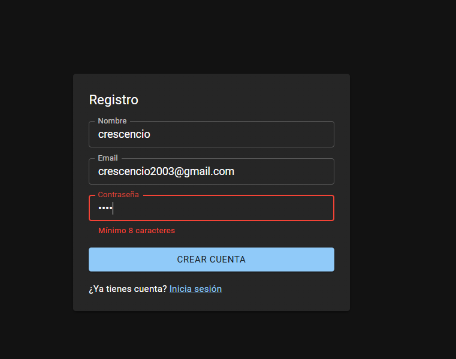
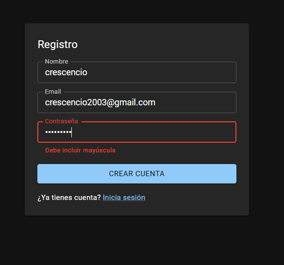
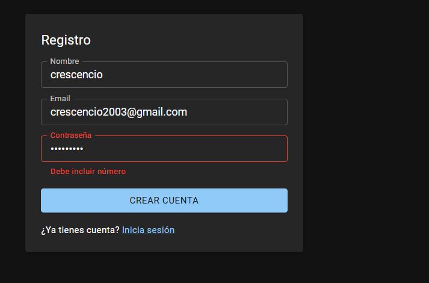
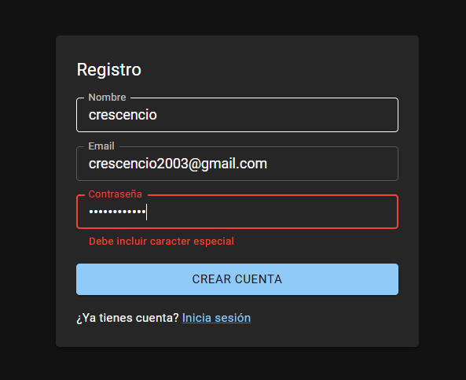

---

### 1.2 - Login de Usuario
**Requisito:** Implementar login con JWT

**Descripción:** Pantalla de login mostrando:
- Formulario funcional de Email y Contraseña
- Validación de credenciales
- Token almacenado en localStorage
- Redirección a catálogo de productos tras login exitoso

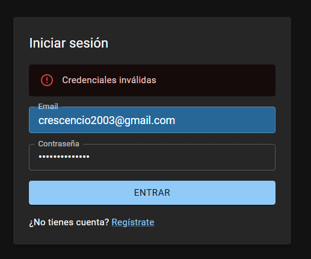

---

### 1.3 - Token JWT en Storage
**Requisito:** Almacenamiento seguro del token

**Descripción:** Consola del navegador mostrando:
- localStorage con la clave 'auth_token' conteniendo el JWT
- Estructura del token (header.payload.signature)

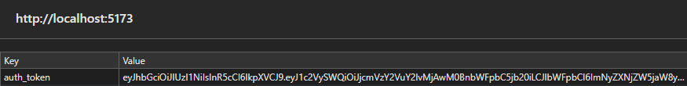

---

## 2️⃣ CATÁLOGO DE PRODUCTOS

### 2.1 - Listado de Productos
**Requisito:** Mostrar catálogo con grid responsivo

**Descripción:** Página de productos con:
- Grid de 4 columnas en desktop
- 3 columnas en tablet
- 2 columnas en móvil
- Todas las tarjetas con tamaño uniforme
- Imágenes con altura fija de 200px
- Información: nombre, precio, botón "Agregar"

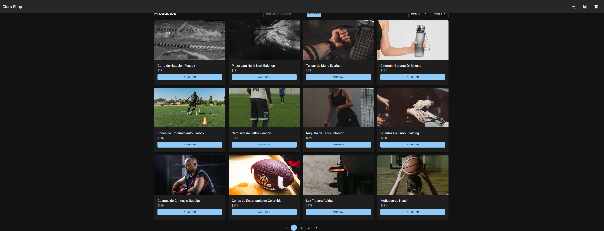

---

### 2.2 - Búsqueda de Productos
**Requisito:** Implementar búsqueda por texto

**Descripción:** Funcionalidad de búsqueda mostrando:
- Input de búsqueda
- Botón "BUSCAR"
- Resultados filtrados
- Sin resultados cuando no hay coincidencias

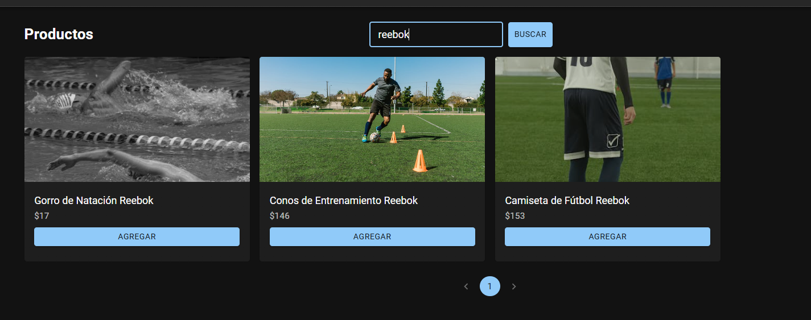

---

### 2.3 - Filtro por Categoría
**Requisito:** Filtrar productos por categoría deportiva

**Descripción:** Select de categorías mostrando:
- Opciones: Todas, Fútbol, Baloncesto, Tenis, Running, Natación, Ciclismo, Gimnasio, Yoga, Pádel, Voleibol, Rugby
- Cambio dinámico de resultados al seleccionar
- URL actualizada con parámetro de categoría

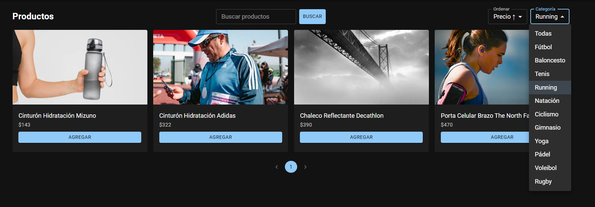

---

### 2.4 - Ordenamiento de Productos
**Requisito:** Ordenar por precio y nombre

**Descripción:** Select de ordenamiento mostrando:
- Opciones: Precio ↑, Precio ↓, Nombre A-Z, Nombre Z-A
- Ordenamiento funcional
- Cambio visible en la lista

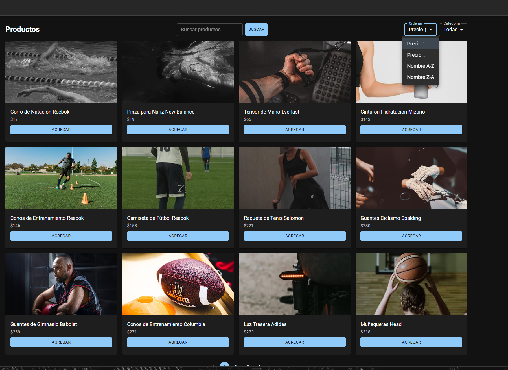

---

### 2.5 - Paginación
**Requisito:** Implementar paginación cursor-based

**Descripción:** Componente de paginación mostrando:
- Botones de navegación (< 1, 2, 3... >)
- 12 productos por página
- Cambio de página sin perder filtros
- URL actualizada

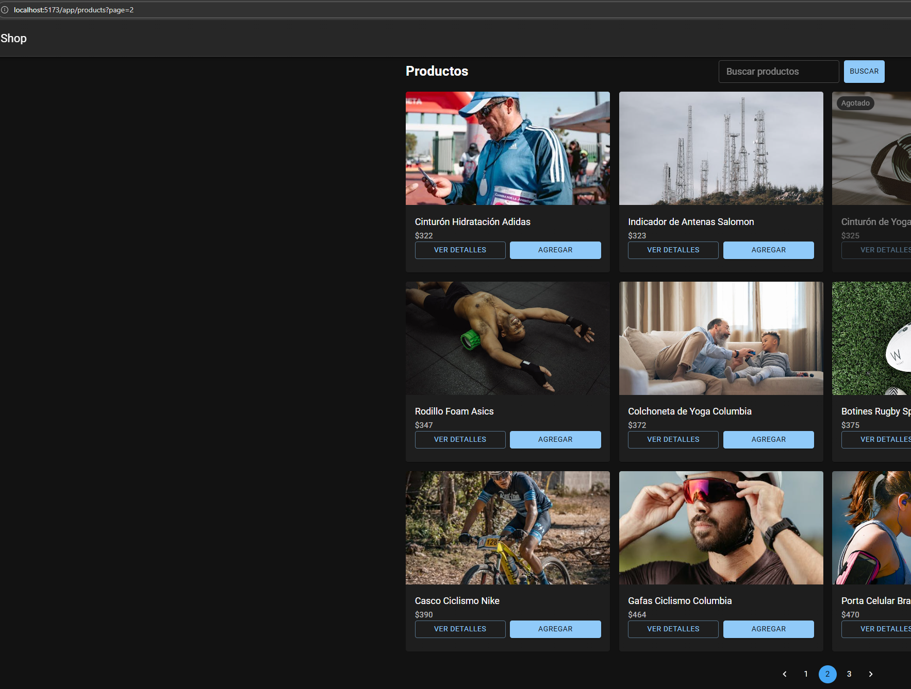

---

### 2.6 - Detalle de Producto
**Requisito:** Mostrar información completa de un producto

**Descripción:** Página de detalle con:
- Imagen ampliada del producto
- Nombre y descripción
- Precio
- Stock disponible
- Botón "Agregar al carrito"
- Link para volver al catálogo

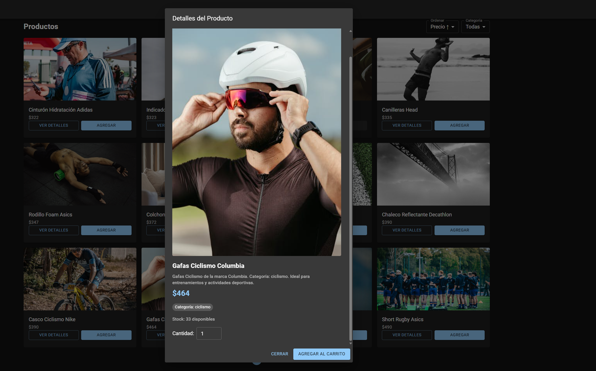

---

### 2.7 - Producto Agotado
**Requisito:** Indicar visualmente productos sin stock

**Descripción:** Productos agotados mostrando:
- Chip "Agotado" en la esquina superior izquierda
- Tarjeta con opacidad reducida
- Botón "Agregar" deshabilitado

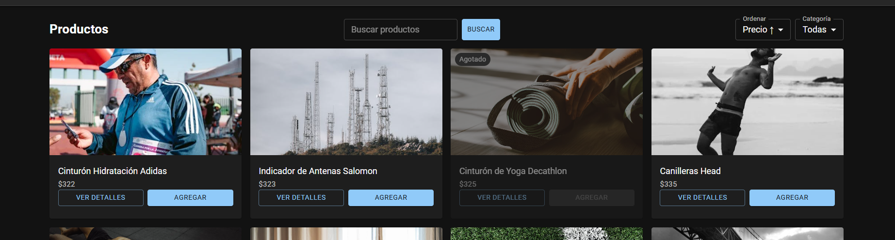

---

## 3️⃣ CARRITO DE COMPRAS

### 3.1 - Agregar al Carrito
**Requisito:** Agregar productos al carrito con UI optimista

**Descripción:** Funcionalidad de agregar mostrando:
- Toast de notificación inmediato "Agregado al carrito"
- Badge del carrito actualizándose con la cantidad
- Actualización de Redux state

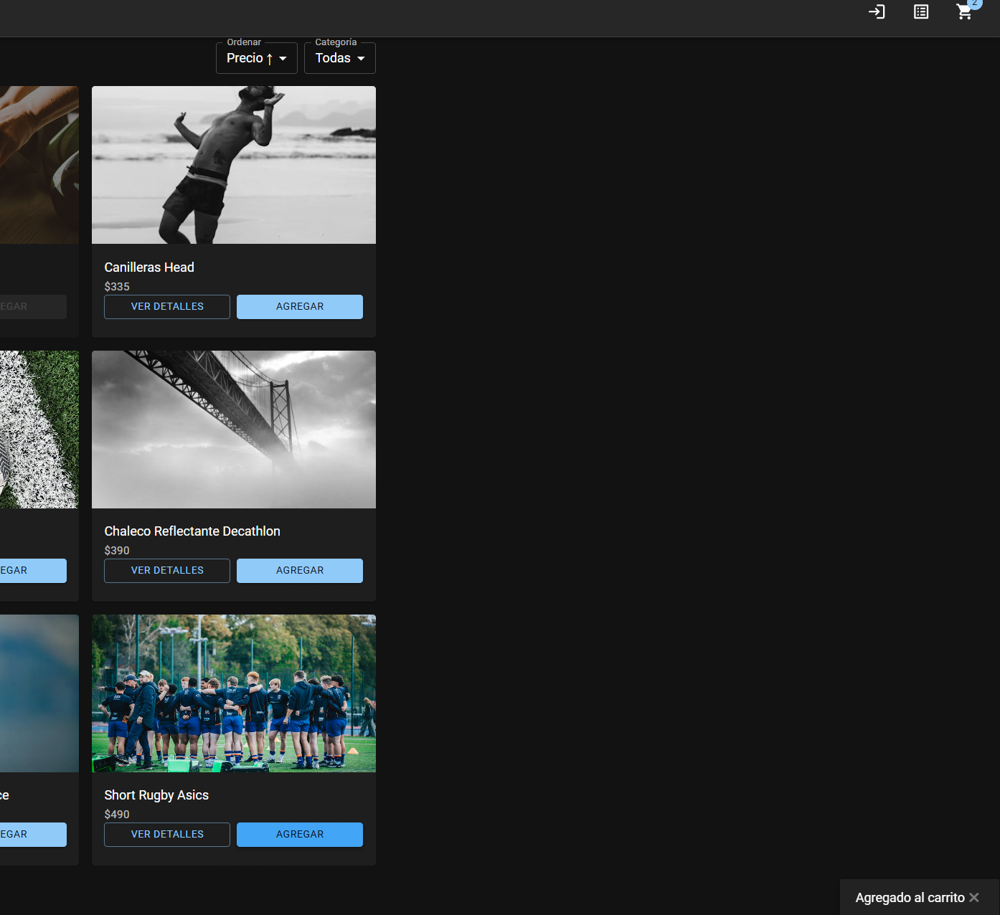

---

### 3.2 - Ver Carrito
**Requisito:** Mostrar todos los items del carrito con detalle

**Descripción:** Página del carrito mostrando:
- Lista de productos agregados
- Imagen, nombre, precio y cantidad de cada item
- Botones +/- para ajustar cantidades
- Botón "Quitar" para eliminar items
- Subtotal y Total
- Botón "Ir a pagar"

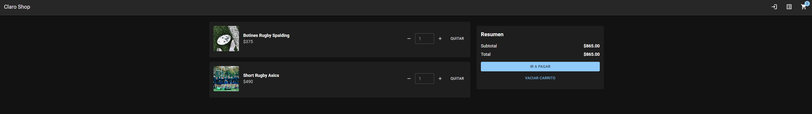

---

### 3.3 - Actualizar Cantidad
**Requisito:** Cambiar la cantidad de productos en el carrito

**Descripción:** Controles de cantidad mostrando:
- Botón "-" para disminuir
- Campo de cantidad (lectura)
- Botón "+" para aumentar
- Actualización de totales
- Toast de confirmación

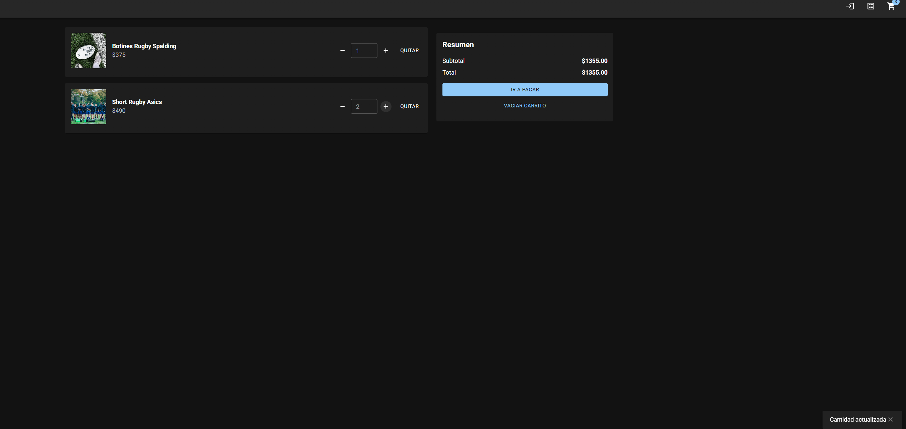

---

### 3.4 - Eliminar del Carrito
**Requisito:** Remover items del carrito

**Descripción:** Eliminación de productos mostrando:
- Botón "Quitar" funcional
- Producto eliminado de la lista
- Totales actualizados
- Toast de confirmación

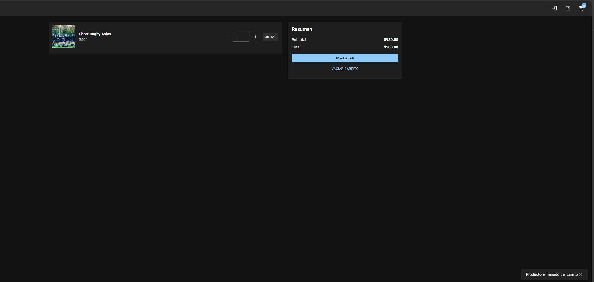

---

### 3.5 - Carrito Vacío
**Requisito:** Mensaje cuando el carrito está vacío

**Descripción:** Vista del carrito vacío mostrando:
- Mensaje "Tu carrito está vacío"
- Botón "Ir a productos" que redirige

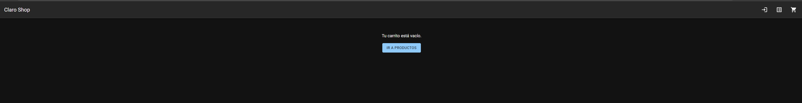

---

### 3.6 - Badge del Carrito
**Requisito:** Indicador de cantidad en la navbar

**Descripción:** Navbar mostrando:
- Badge rojo con número de items totales
- Actualización en tiempo real
- Link funcional a /app/cart

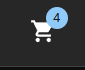

---

## 4️⃣ CHECKOUT Y ÓRDENES

### 4.1 - Checkout
**Requisito:** Crear orden limpiando el carrito

**Descripción:** Página de checkout mostrando:
- Resumen de la compra
- Total final
- Botón "Confirmar compra"
- Redirección a órdenes tras éxito
- Carrito vaciado

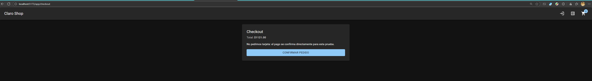

---

### 4.2 - Email de Confirmación de Orden
**Requisito:** Envío de email tras crear una orden

**Descripción:** Email de confirmación mostrando:
- Asunto con identificación de la orden
- Datos del cliente
- Detalle de productos comprados
- Cantidades y precios
- Total de la compra
- Fecha y hora de la orden

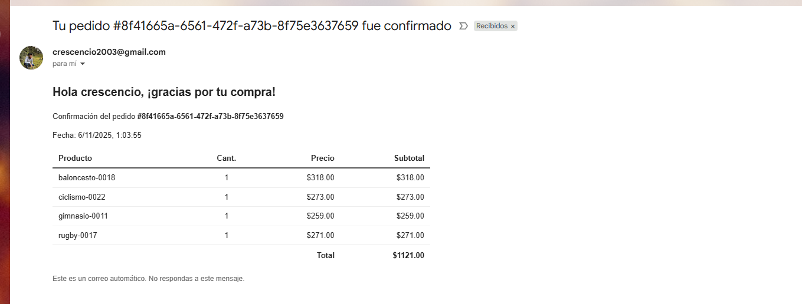

---

### 4.3 - Listado de Órdenes
**Requisito:** Mostrar historial de órdenes del usuario

**Descripción:** Página de órdenes mostrando:
- Tabla/lista de órdenes
- ID de orden, fecha, total
- Links a detalle de cada orden
- Paginación si hay muchas órdenes

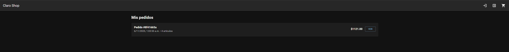

---

### 4.4 - Detalle de Orden
**Requisito:** Ver información completa de una orden

**Descripción:** Página de detalle mostrando:
- ID de orden
- Fecha de creación
- Estado (CREATED)
- Lista de items
- Cantidades y precios
- Total de la orden

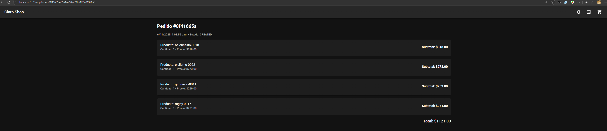

---

## 5️⃣ DESARROLLO LOCAL - BACKEND Y SIMULACIÓN

### 5.1 - Serverless Offline Funcionando

**Requisito:** Servidor Lambda local corriendo

**CAPTURA:** Terminal mostrando el servidor iniciado (puerto 3000)

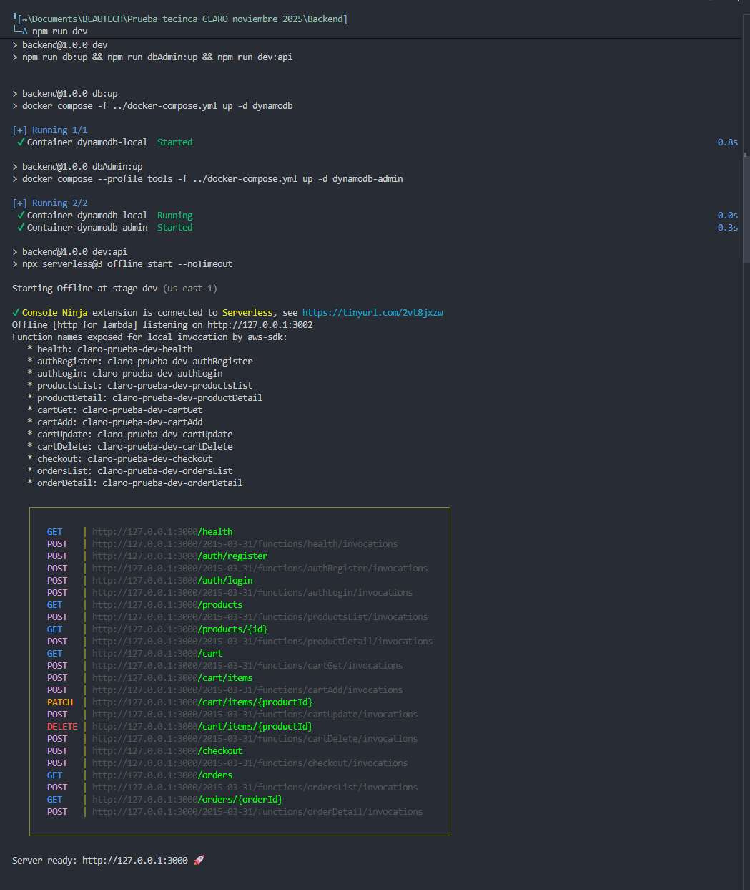

---

### 5.2 - Winston Logger - Consola

**Requisito:** Logs estructurados en terminal con [info], [warn] y [error]

**CAPTURA:** Terminal con logs de los 3 niveles

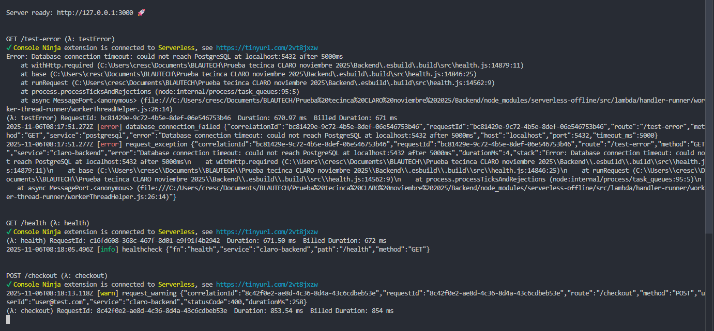

---

### 5.3 - Variables de Entorno

**Requisito:** Configuración local con .env

**CAPTURA:** Archivo `.env` o `.env.local` en VS Code

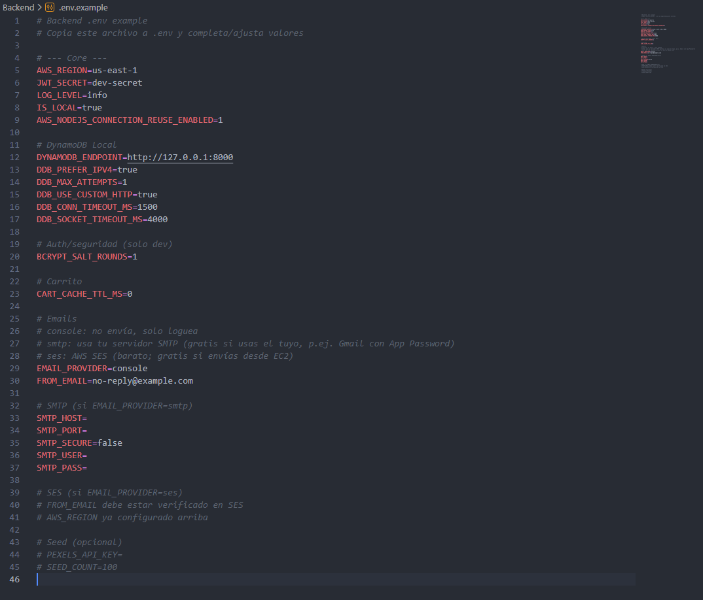

---

### 5.4 - DynamoDB Local

**Requisito:** Base de datos local con productos

**CAPTURA:** Terminal mostrando seed ejecutado exitosamente

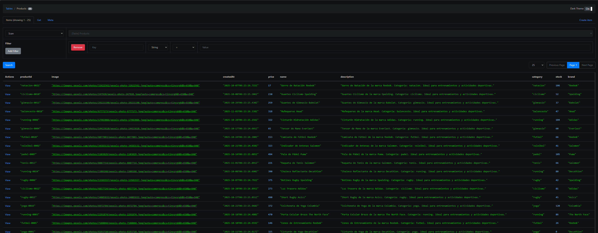
